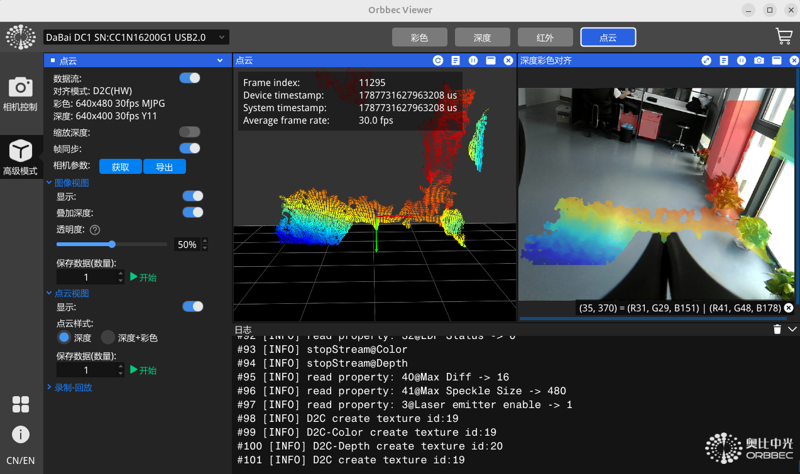

# Orbbec相机连接和二次开发
## 1. OrbbecView 软节调试

### 重点官方要求安装 Linux udev 规则的
```sh
cd ~/OrbbecViewer_v1.10.27_202509260133_linux_x64_release/scripts
sudo chmod +x install_udev_rules.sh
sudo ./install_udev_rules.sh
sudo udevadm control --reload-rules
sudo udevadm trigger
```
运行命令后，要重新插拔相机的数据线，就可以成功连接了。
软节详细用法介绍可以参考官方的文件：
https://github.com/orbbec/OrbbecSDK/blob/main/doc/OrbbecViewer/English/OrbbecViewer.md
## 2. pyorbbecsdk

首次下载源码：
```sh
git clone -b main \
https://github.com/orbbec/pyorbbecsdk.git
```
首次下载要按照官方步骤重新编译：
```sh
cd ~/PiPER_X/orbbec/pyorbbecsdk

rm -rf build install

python3 -m pip install -r requirements.txt

mkdir build
cd build
cmake -Dpybind11_DIR="$(pybind11-config --cmakedir)" ..
make -j$(nproc)
make install
cd ~/PiPER_X/orbbec/pyorbbecsdk
export PYTHONPATH="$(pwd)/install/lib:$PYTHONPATH"
```
首先要配置PYTHONPATH才能识别到pyorbbecsdk库，执行：
```sh
source orbbec/setup_orbbec.sh
```
```py
pipeline = Pipeline() # 连接相机
config = Config() # 创建配置对象

# todo: 配置彩色相机数据流
color_profiles = (
        pipeline.get_stream_profile_list(
            OBSensorType.COLOR_SENSOR #  彩色相机传感器
        )
    )
    color_profile = (
        color_profiles.get_default_video_stream_profile()
    )
    print(
        "Color profile:",
        color_profile
    )
    config.enable_stream(
        color_profile
    )

# todo: 配置深度相机传感器数据流
depth_profiles = (
        pipeline.get_stream_profile_list(
            OBSensorType.DEPTH_SENSOR # 深度传感器
        )
    )
    depth_profile = (
        depth_profiles.get_default_video_stream_profile()
    )
    print(
        "Depth profile:",
        depth_profile
    )
    config.enable_stream(
        depth_profile
    )

# todo: 按照配置启动相机
pipeline.start( 
        config
    )  

frames = pipeline.wait_for_frames(
            1000
        ) # 等待一组帧，最长等待时间1s
if frames is None:
    continue

# ------------------------------------------------
# 获取Color数据
# ------------------------------------------------
color_frame = (
    frames.get_color_frame()
)

# ------------------------------------------------
# 获取Depth数据
# ------------------------------------------------
depth_frame = (
    frames.get_depth_frame()
)
if (
    color_frame is None
    or depth_frame is None
):
    continue

# todo: 关闭设备
pipeline.stop()
```